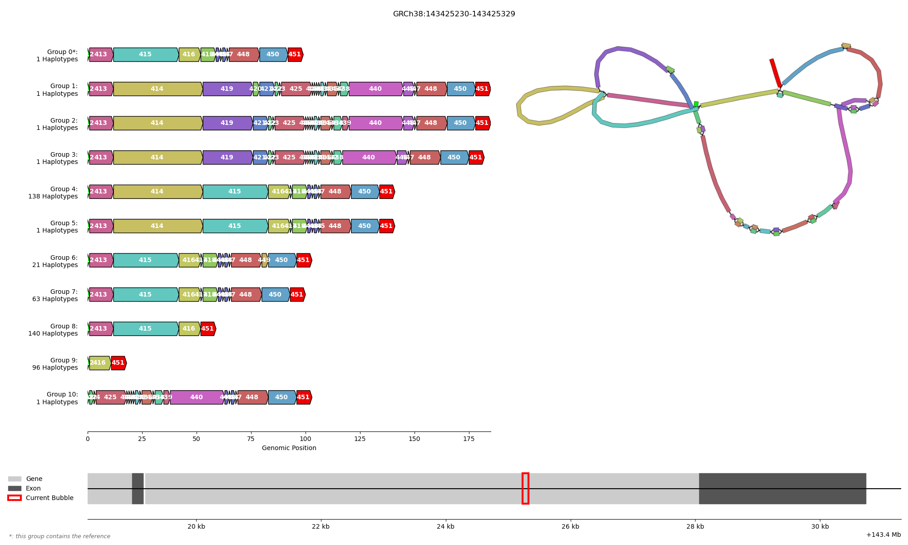

# bubblotter
Simple tool for plotting SV bubbles within a GFA file.

## Usage
Requirements:
- python3
  - numpy
  - scipy
  - matplotlib
- [vg](https://github.com/vgteam/vg)
- [Bandage](https://github.com/rrwick/Bandage)

Subset the graph to your region of interest, e.g. a single gene. This is important as `bubblotter` will try to draw every non-simple* top-level bubble within the graph. So inputting a large file will result in many images. This can be done for example like:
```bash
vg chunk -x "my_graph.gfa" -p 'GRCh38#0#chr8:143418256-143421518' -c 20 -O gfa > roi.gfa
```
Please ensure that the GFA file contains P- or W-lines.

Now you can run `bubblotter` like:
```bash
./bubblotter.py roi.gfa work -r GRCh38 -a gencode.v50.basic.annotation.gff3 -s "chr8"
```
In this case `roi.gfa` is the region of interest graph, `work` the name of the working directory (`bubblotter` will store all of its results there).
`-r GRCh38` specifies the name of the reference, `-a gencode.v50.basic.annotation.gff3` provides a annotation of genes/exons and `-s "chr8"` tells `bubblotter` to look only for annotations in chromosome 8.

This results in multiple plots like:



Each plot shows on the left side a gene-arrow-like haplotype plot, each line consisting of all the haplotypes (paths) that have the same sequence in this bubble. Each arrow is a single node, the direction indicating the direction of the node traversal. The top-most
line is always the group of haplotypes containing the reference (if a reference is specified). The start and end nodes of the bubble are marked in bright green and red respectively. The right side contains a plot of the graph generated using Bandage, the colors matched
to the left plot. Below these plots is a minimap showing the position of this bubble (red) in the graph given to `bubblotter` in terms of reference coordinates. If an annotation is given, then this minimap also shows the location of genes in light grey and exons in dark grey.

The plots are named to sort in order of their appearance in the graph, so if all of the plots are opened at the same time (e.g. under Linuxes with loupe using `loupe work/*.gfa.png`), then one can skip from bubble to bubble by switching images in the image viewer (often using the arrow keys).

The `work` directory also contains `.tsv` files containing which haplotype is part of which group for each bubble.

\* non-simple bubbles are by-default all bubbles that are not:
- bubbles containing 4 or less nodes, all of length 1 (likely some form of SNP or 1bp INS/DEL)
- bubbles containing a single insertion or deletion that is less than 50 bps in length (can be turned back on using the parameter `--include_ins`)

## Full example
This example requires that `vg` is installed. It should usually be installed as a requirement of `bubblotter`, but if its not use `conda install -c bioconda vg` to install it.

This example showcases how you can plot all of the bubbles in the MAFA gene of the human HPRCv2.1 MC graphs. 

```bash
# Download the reference annotation and un-gzip it
wget https://ftp.ebi.ac.uk/pub/databases/gencode/Gencode_human/release_50/gencode.v50.basic.annotation.gff3.gz
gunzip gencode.v50.basic.annotation.gff3.gz

# Download the HPRC minigraph cactus graph for chromosome 8
wget https://s3-us-west-2.amazonaws.com/human-pangenomics/pangenomes/scratch/2025_12_23_minigraph_cactus/hprc-v2.1-mc-grch38/chrom-alignments/chr8.vg

# Extract the region of interest
vg chunk -x chr8.vg -p "GRCh38#0#chr8:143419191-143430700" -c 20 -O gfa > MAFA_c20.gfa

# Run bubblotter
bubblotter MAFA_c20.gfa work -r GRCh38 -a gencode.v50.basic.annotation.gff3 -s "chr8"
```
